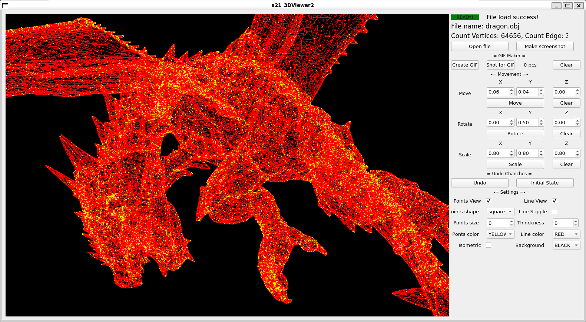

# 3D_Viewer_2
The program for visualizing the wireframe of 3D objects from OBJ file format.

Qt Framework

Program language C++17

Used pattern:
- MVC
- Memento
- Command
- Factory

## Installation

    make install

Default installation folder - `Desktop`

## Usage
Use the "Open file" button and select the OBJ file.
The program displays the 3d wireframe of the model on the screen. Use the mouse to rotate, move and scale the object, or enter values manually. Change vertex, edge and background colors, create animated GIF files up to 5 seconds. Have fun.

View 3D wireframes like in the movie The Matrix. Tell your friends, neighbors, cat and guinea pig. Let them all download and spin the models with us. Immerse yourself in the fascinating world of 3D wireframes! The whole world on your display!

Able to save your settings in a file. Don't stop when working with large files. The program is able to make you quit everything and start twisting models using the mouse! Use it anywhere: at home, at work and on the road. Time killing guaranteed.

If rotating the model is no longer fun, try creating animated GIF files. Use the "Shot fo GIF" button to take a picture. And "Create GIF" to create a file from a set of screenshots. Keep enjoying.

## Remove

    make uninstall